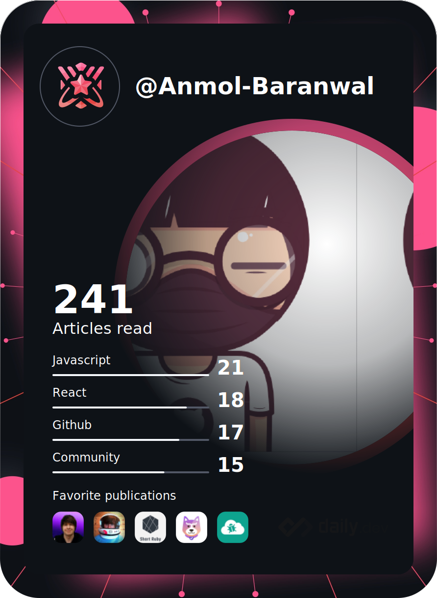

<!--- ------------------------------------------------------------------------------------------------------------------------------------------------------ -->
<!--- -- Typing SVG ---------------------------------------------------------------------------------------------------------------------------------------- -->
<!--- ------------------------------------------------------------------------------------------------------------------------------------------------------ -->

  

<!--- ------------------------------------------------------------------------------------------------------------------------------------------------------ -->
<!--- -- Visitor Badge ------------------------------------------------------------------------------------------------------------------------------------- -->
<!--- ------------------------------------------------------------------------------------------------------------------------------------------------------ -->

 

<!--- ------------------------------------------------------------------------------------------------------------------------------------------------------ -->
<!--- -- Brief Info + Dev Card ----------------------------------------------------------------------------------------------------------------------------- -->
<!--- ------------------------------------------------------------------------------------------------------------------------------------------------------ -->
 
 

<i>&nbsp; There's nothing quite like the thrill of having your work recognized and appreciated by the community. </i>  

🎓 &nbsp; I'm completing my Bachelor of Technology in the field of computer science.

🔥 &nbsp; Proudly active in supportive programming community on [daily.dev](https://app.daily.dev/Anmol-Baranwal) with <em>5k+</em> reputation.

🎯 &nbsp; I am continuously exploring and developing projects on cutting-edge technologies like Next.js

🌐 &nbsp; Let's collaborate and spark new ideas together by connecting on [LinkedIn](https://www.linkedin.com/in/Anmol-Baranwal/).

🚀 &nbsp; My expertise as a Full-Stack developer is complemented by my passion for community engagement.

😄 &nbsp; I also have a soft spot for [chess](https://lichess.org/@/Anmol_Baranwal
), technical writing on [dev.to](https://dev.to/anmolbaranwal), and contributing to open-source projects.

   

## Latest Blog Posts  

 

<!-- BLOG-POST-LIST:START -->
- [10 Reasons Why GitHub will change your Life Forever](https://dev.to/anmolbaranwal/10-reasons-why-i-love-github-a-10-month-journey-of-passion-and-growth-23h5)
- [20 Tools for Building Stunning Websites without coding](https://dev.to/anmolbaranwal/20-game-changing-website-builders-to-build-classy-websites-without-coding-4ll7)
- [Create Mind-blowing Videos with These AI Tools](https://dev.to/anmolbaranwal/create-stunning-videos-with-these-7-ai-powered-editing-tools-2k9d)
- [7 Incredible Communities That Will Change Your Life Forever](https://dev.to/anmolbaranwal/7-incredible-communities-that-will-change-your-life-forever-28n1)
- [Ultimate List of Chrome Extensions](https://dev.to/anmolbaranwal/350-chrome-extensions-to-unleash-your-productivity-4k2o)
- [400 Free AI Tools - Unleashing the Power of AI](https://dev.to/anmolbaranwal/200-free-ai-tools-unleashing-the-power-of-ai-eb0)
<!-- BLOG-POST-LIST:END -->

<!--- ------------------------------------------------------------------------------------------------------------------------------------------------------ -->
<!--- -- Activity Graph ------------------------------------------------------------------------------------------------------------------------------------ -->
<!--- ------------------------------------------------------------------------------------------------------------------------------------------------------ -->

 

<!--- ------------------------------------------------------------------------------------------------------------------------------------------------------ -->
<!--- -- Skills Section ------------------------------------------------------------------------------------------------------------------------------------ -->
<!--- ------------------------------------------------------------------------------------------------------------------------------------------------------ -->

# Skills?  

  
  
  
  
  
  
   
  
  
  
  
   
  
  
  
  
   
  
  
  
  
  
  
  

 

<!--- ------------------------------------------------------------------------------------------------------------------------------------------------------ -->
<!--- -- Skills Section ------------------------------------------------------------------------------------------------------------------------------------ -->
<!--- ------------------------------------------------------------------------------------------------------------------------------------------------------ -->

# My Projects 

| Projects | Deployed Link | Repository | Tech Stack |
|:---------|:-------------:|:----------:|:-----------|
| Coffee Compass | [view](https://coffee-project-anmol-baranwal.vercel.app/) | - | `Next.js` `JavaScript` `Postman` `Airtable Database` `CSS3` |
| ToDo List Web App | [view](https://todo-list-k7qu.onrender.com/) | [view](https://github.com/Anmol-Baranwal/ToDo-List-WebApp) | `Node.JS` `Express.JS` `JavaScript` `MongoDB` `Bootstrap` |
| Client's Portfolio | [view](https://anmol-baranwal.github.io/Portfolio-Akanksha/) | [view](https://github.com/Anmol-Baranwal/Portfolio-Akanksha) | `JavaScript` `Bootstrap` `jQuery` `Vanilla Tilt` `Owl Carousel` `Typed JS` |
| Notes Keeper App | [view](https://notes-keeper-app-i91s.vercel.app/) | - | `React` `JavaScript` `CSS3` `HTML5` |
| Password Power | [view](https://password-generator-anmol-baranwal.vercel.app/) | - | `JavaScript` `CSS3` `HTML5` |
| Color Shade Tool | [view](https://color-darken-tool.vercel.app/) | - | `JavaScript` `CSS3` `HTML5` |
| Conceptual Mini Projects | - | [view](https://github.com/Anmol-Baranwal/Conceptual-Projects) | `JavaScript` `SCSS` `Tailwind` `jQuery` `Node.JS` `Express.JS` |
| C++ Special Programs | - | [view](https://github.com/Anmol-Baranwal/CPP-Special-Programs) | `C++` |

 

<!--- ------------------------------------------------------------------------------------------------------------------------------------------------------ -->
<!--- -- Metrics ------------------------------------------------------------------------------------------------------------------------------------------- -->
<!--- ------------------------------------------------------------------------------------------------------------------------------------------------------ -->

# Metrics

<!-- You can check the workflows here: (.github/workflows)   -->

  
Expand
 

| Overview | Follow up Issues & PRs |
|:--------:|:-------------------------:|
|  |  |
| Leetcode Stats | Notable Contributions |
|  |  |
| Achievements | Lanugage Activity |
|  |  |
| Discussions | Reactions |
|  |  |

                     
 

<!--- ------------------------------------------------------------------------------------------------------------------------------------------------------ -->
<!--- -- My Socials ---------------------------------------------------------------------------------------------------------------------------------------- -->
<!--- ------------------------------------------------------------------------------------------------------------------------------------------------------ -->

#  The Social Network

  
<!--- ------------------------------------------------------------------------------------------------------------------------------------------------------ -->
<!--- -- Let's Chat Here ------------------------------------------------------------------------------------------------------------------------------------ -->
<!--- ------------------------------------------------------------------------------------------------------------------------------------------------------ -->

#  The Online Hangout

<!--- ------------------------------------------------------------------------------------------------------------------------------------------------------ -->
<!--- -- Support Me Here ----------------------------------------------------------------------------------------------------------------------------------- -->
<!--- ------------------------------------------------------------------------------------------------------------------------------------------------------ -->

#  Fuel my passion 

  

<!--- ------------------------------------------------------------------------------------------------------------------------------------------------------ -->
<!--- -- GitHub Stats ------------------------------------------------------------------------------------------------------------------------------------ -->
<!--- ------------------------------------------------------------------------------------------------------------------------------------------------------ -->

|  |  |
| -- | -- |

<!--- ------------------------------------------------------------------------------------------------------------------------------------------------------ -->
<!--- -- Snake Contribution Graph -------------------------------------------------------------------------------------------------------------------------- -->
<!--- ------------------------------------------------------------------------------------------------------------------------------------------------------ -->

 
<!--
=======================================    COMMENTS     =======================================
tokyonight vs radical

Themes: gruvbox, radical, tokyonight

-->
